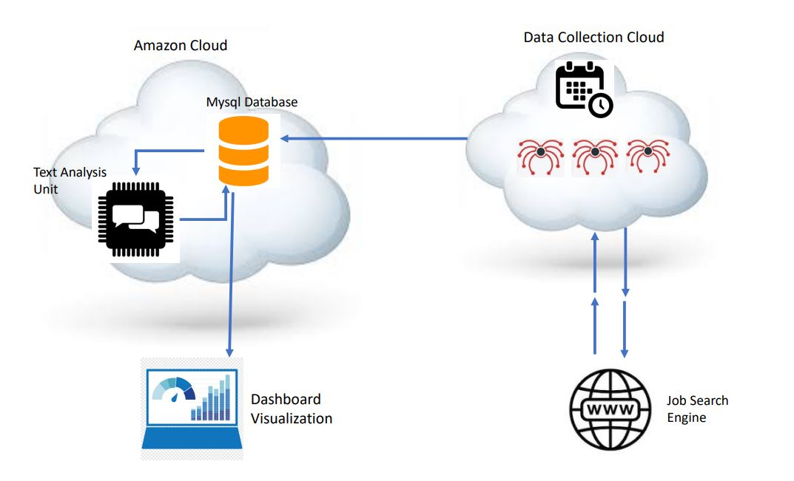
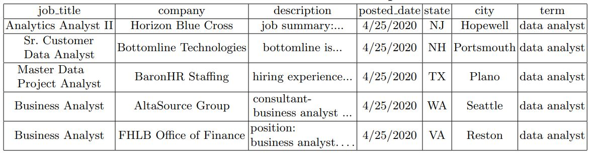
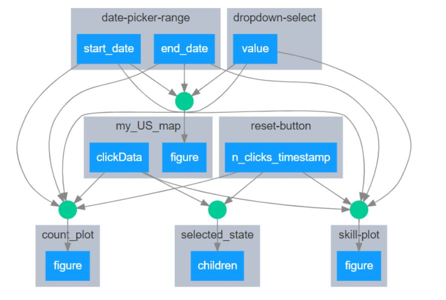
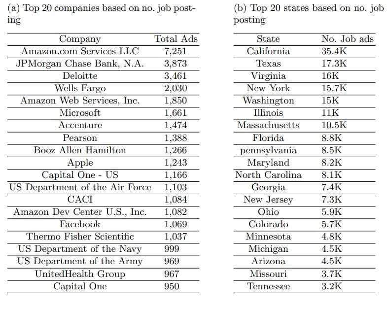
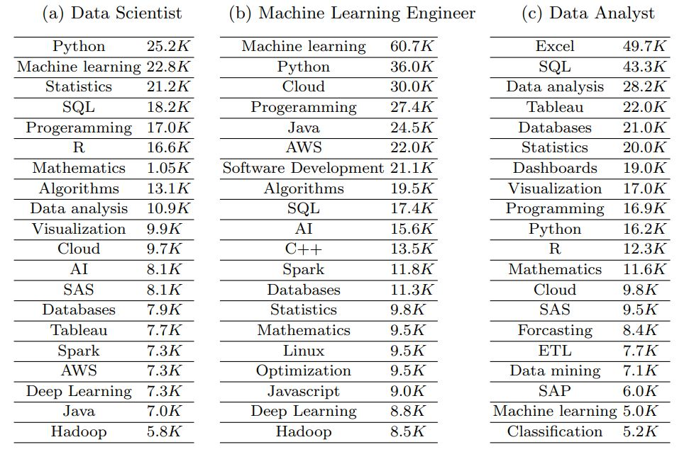
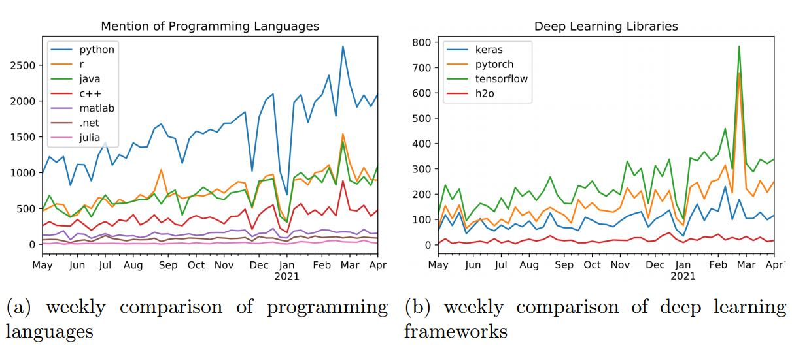

|ResearchGate| |arxiv| |GitHublicense| |Demo| |twitter|

Referenced paper : `Toward Knowledge Discovery Framework for Data Science Job Market in the United States <https://arxiv.org/abs/2106.11077>`__

|pic|

Toward Knowledge Discovery Framework for Data Science Job Market in the United States
======================================================================================

The growth of the data science field requires better tools to understand such a fast-paced growing domain. Moreover, individuals from different backgrounds became interested in following a career as data scientists. Therefore, providing a quantitative guide for individuals and organizations to understand the skills required in the job market would be crucial. This paper introduces a framework to analyze the job market for data science-related jobs within the US while providing an interface to access insights in this market. The proposed framework includes three sub-modules allowing continuous data collection, information extraction, and a web-based dashboard visualization to investigate the spatial and temporal distribution of data science-related jobs and skills. The result of this work shows important skills for the main branches of data science jobs and attempts to provide a skill-based definition of these data science branches. The current version of this application is deployed on the web and allows individuals and institutes to investigate skills required for data science positions through the industry lens.

Method
======

Overview of data science skill tracking system
----------------------------------------------

Figure shows an overview of the proposed system. Each of these modules will be described in more detail in the following. As it can be seen in this Figure  , this system heavily relies on cloud computing structures that provide stable facilities for continuous tasks with scheduling to collect, analyze, and present its findings dynamically.

Data Collection Sample
----------------------

This shows samples of the returned fields for queries on data analyst. For a framework like the one presented, it is not feasible to use a local machine for data collection as it requires to work continuously for a long period of time with no interruptions (such as internet disconnection or power outage, etc.). Such a machine and maintaining its connectivity would cause a lot of hassle and scrapy cloud services solve this problem by understanding the data collection framework. It allows to create periodic jobs to continuously collect the data using this platform. This module runs its data collection spiders every week and samples job postings on web periodically. The results of these queries are then delivered into a mysql database on Amazon web services (AWS) for further processing that will be explained in the next section.

Interaction graph of visualization components
----------------------------------------------

The effect and interactions between these components are complex. Figure shows these interactions in our dash model. As it can be seen the spatial and temporal aspect of skills could be investigated by using these components. Other components would be added as the work continues.

Top 20 results based on no. job by states and company
------------------------------------------------------

This Table shows the top 20 companies during this period. Despite the expectation that tech sector dominate the field, it appears that other sectors contribute to this market significantly. Namely, consultant and advisory section (e.g. Booz Allen, Deloitte)and financial institutes(e.g JPMorgan, Wells Fargo) and government organization contribute significantly to this market along with the tech sector.

 
 
 
Top skills for the three main tracks
------------------------------------

This Table shows the top 20 skills in each job posting category. The result in this table clearly shows the difference between these main tracks of data science. While machine learning engineer job postings mostly shows a domination of skills such as programming, machine learning, cloud, and big data technologies, a data analyst mostly needs skills for data retrieving (e.g. SQL, Excel,database), and Visualization (e.g Tableau, Power BI). 

Temporal insights of data science skills
----------------------------------------

Left Figure shows this comparison between top programming languages mentioned during this period.As it can be seen, the top language is python following by R and Java. This indicated not only python is the most dominant language but the trend and the gap shows it appears to be in demand in future in comparison to others. Similarly, a comparison between deep learning framework is presented in right Figure. The result shows that tensorflow followed by pytorch are the most mentioned deep learning frameworks. Also H2O~(an R based package) is mentioned much less which indicates the overwhelming attention to python for deep learning. As it can be seen, the framework allows temporal insights to this job market and based on their general importance, such insights can be added to the interface designed for users.

Conclusion
==============

This paper introduces a framework capable of collecting and analysing of spatial and temporal aspects of data science's job market using available tools within data science toolbox. The framework provides a free front-end interface developed using plotly dash for this market. The result provides a quantitative guide for individuals and organizations to recognize the most important skills and concepts in this domain based on industry perception.
Possible extension to the work here includes sector analysis of job posting and improving on skill extraction technique. Other temporal insights will be added to the interface based on the importance of the information they can add for individuals using this interface.

Error and Comments:
===================

Send an email to mh4pk@virginia.edu

Citation:
=========

.. code:: bash

    @inproceedings{heidarysafa2021knowledge,
    title={Toward Knowledge Discovery Framework for Data Science Job Market in the United States},
    author={Mojtaba Heidarysafa and Kamran Kowsari and Masoud Bashiri and Donald E. Brown},
    year={2021},
    eprint={2106.11077},
    archivePrefix={arXiv},
    primaryClass={cs.CY}
    }

.. |pic| image:: docs/animation.gif

.. |Demo| image:: https://img.shields.io/badge/Demo-V.1.1-orange
     :target: https://dsi-usa2.herokuapp.com/

.. |arxiv| image:: https://img.shields.io/badge/arXiv-2106.11077-red.svg
    :target: https://arxiv.org/abs/2106.11077
    
.. |GitHublicense| image:: https://img.shields.io/badge/licence-GPL-blue.svg
   :target: ./LICENSE

.. |ResearchGate| image:: https://img.shields.io/badge/ResearchGate-blue.svg?style=flat
   :target: https://www.researchgate.net/publication/352465534_Toward_Knowledge_Discovery_Framework_for_Data_Science_Job_Market_in_the_United_States

.. |twitter| image:: https://img.shields.io/twitter/url/http/shields.io.svg?style=social
    :target: https://twitter.com/intent/tweet?text=Toward%20Knowledge%20Discovery%20Framework%20for%20Data%20Science%20Job%20Market%20in%20the%20United%20States%0aGitHub:&url=https://github.com/mojtaba-Hsafa/data-science-jobs-app&hashtags=Job,market,DataScientists,MachineLearning,USA,
